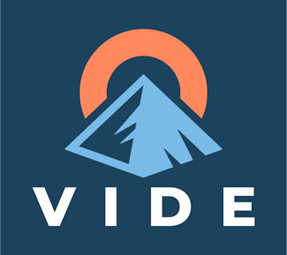
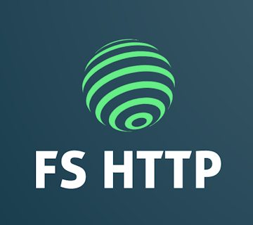

<h1 align="center">Hello Everyone 👋</h1>
<h4 align="center">F# ❤️ Developer | Tech Consultant | OSS Creator | Conference Speaker</h4>

    <a href="https://foundation.fsharp.org/results_applied_fsharp_2019">Recognized F# Expert</a>
     
    <a href="https://linktr.ee/SchlenkR">My linktr.ee</a>

---

## PXL-Clock

Allow me a bit of advertising for the PXL-Clock! It's a fun device, made with ❤️ - and it's programmable in an easy and quick way.

  

Find out more:

- On the [PXL Clock Discord Server](https://discord.gg/KDbVdKQh5j)
- check out the [PXL Clock Repo on GitHub](https://github.com/CuminAndPotato/PXL-Clock)
- Visit the official [PXL Clock Store](https://www.pxlclock.com)

  <h3>Join the PXL Clock Community on Discord</h3>
  

---

## What I do

> Build software that is performant, **maintainable** over years, **scalable** and **affordable**.

> Helping people to **improve skills together**.

> 🚀 As a freelancer, **you can hire me**.

> :phone: Contact me on 👉🏼 [Twitter](https://twitter.com/schlenkr)

> :book: Exchanging knowledge and discourse are valuable.

### Technologies

Although techologies, stacks, tools matter, it's the first sentence from the list above that really matters. For anything else:

* .Net, C#, JavaScript, TypeScript, and many, many more buzzwords on a daily basis.
* Interested in the next level of development? Let's do some real-world F# together.

## OSS Development

 

Creator of **[Vide](https://github.com/schlenkr/vide)** - For  Reactive UIs (Web / Desktop / Mobile), Digital Signal Processing and More!

 

 
 

Creator of **[FsHttp](https://github.com/schlenkr/FsHttp)**  - A lightweight C# and F# HTTP library

 

 
 

Creator of **[The Blunt](https://github.com/schlenkr/TheBlunt)** - A a one-file recursive descent parser combinator library for F# and Fable.

 

 
 

Creator of **[Trulla Templates](https://github.com/schlenkr/Trulla)** - It's like Handlebars or Mustache, but statically typed and safe!

 
