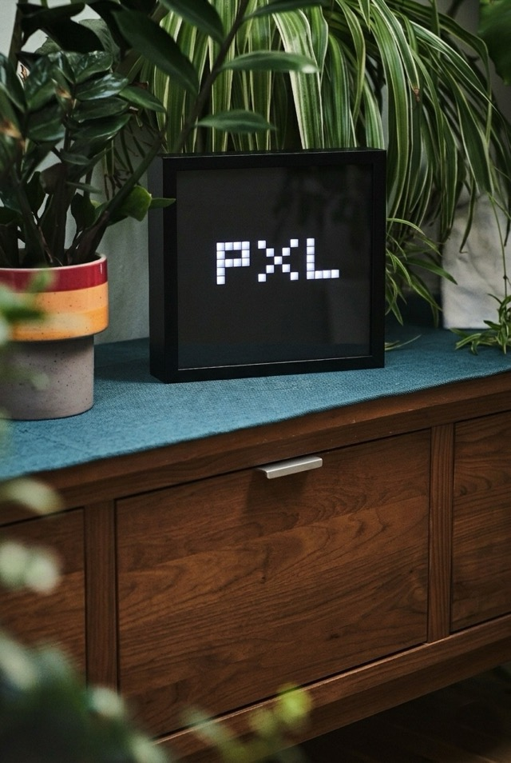
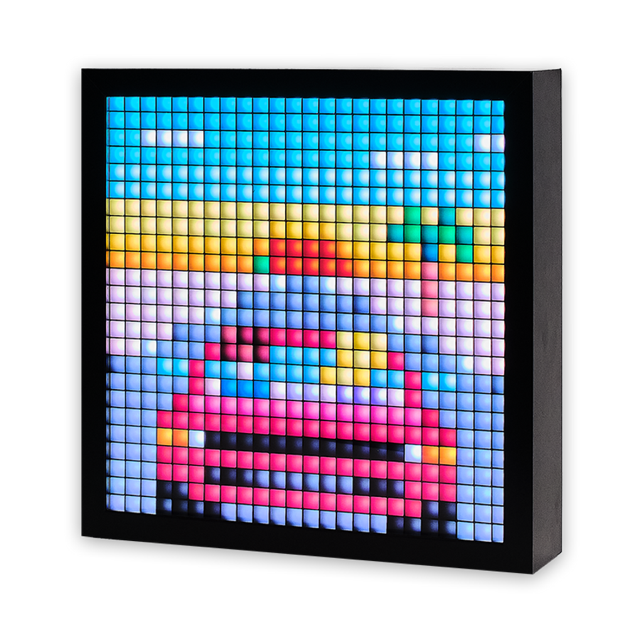

<h1 align="center">Hi - I'm Ronald 👋</h1>
<h4 align="center">Pragmatic engineering consulting · F#, .NET, AI workflows · Frankfurt & Remote EU</h4>

  <a href="https://schlenkr.github.io/schlenkr/"><strong>Homepage playground</strong></a>
  &nbsp;·&nbsp;
  <a href="https://youtube.com/@ThePureState">YouTube&nbsp;@ThePureState</a>
  &nbsp;·&nbsp;
  <a href="https://linktr.ee/SchlenkR">Linktree</a>

  <a href="https://foundation.fsharp.org/results_applied_fsharp_2019">Recognized F# Expert · Applied F# 2019</a>

---

## What I do

> **Training · Consulting · Engineering.**
> I help technically ambitious teams build AI-assisted workflows that stay
> reproducible, maintainable, and honest about their limits - with fifteen
> years of functional-programming habit in the back pocket.
>
> Based in Frankfurt. Work across DACH and remote EU.

📫 Reach out on [Bluesky](https://bsky.app/profile/schlenkr.bsky.social) or LinkedIn.

---

## 🧪 Homepage playground

Rather than a single landing page, I've been exploring **27 variants** of a
consulting homepage in parallel - same content, wildly different design and
structure theses. It's a live demonstration of how I iterate with AI on real
work (Vite MPA, CDN-only, no framework lock-in).

🔗 **Live**: [schlenkr.github.io/schlenkr](https://schlenkr.github.io/schlenkr/) · [Repo](https://github.com/SchlenkR/schlenkr)

## 🕒 PXL Clock

With Sefa I co-founded the **PXL Clock** - a 24×24 programmable LED display
you code in C# or F#. 576 RGB-LEDs behind real glass, hand-assembled in
Frankfurt, limited batches.

<table>
<tr>
<td width="50%"></td>
<td width="50%"></td>
</tr>
</table>

🔗 [pxlclock.com](https://www.pxlclock.com) &nbsp;·&nbsp; [Repo](https://github.com/SchlenkR/pxl-clock) &nbsp;·&nbsp; [Discord](https://discord.gg/KDbVdKQh5j) &nbsp;·&nbsp; [YouTube: Programming PXL Clock](https://www.youtube.com/watch?v=siH60NSN1XA) &nbsp;·&nbsp; [Unboxing](https://www.youtube.com/watch?v=_fpIXysgdls)

---

## 📦 Open Source (selected)

<table>
<tr>
<td width="50%" valign="top">
 

#### FsHttp

Hackable HTTP client for .NET (F# / C#) - write and run requests in F#
Interactive or C# scripts. **128+** dependent packages.

🔗 [Repo](https://github.com/fsprojects/FsHttp) &nbsp;·&nbsp; 

</td>
<td width="50%" valign="top">
 

#### Vide

State-aware function composition for UIs and digital signal processing -
one core idea, two very different outputs.

🔗 [Repo](https://github.com/SchlenkR/Vide) &nbsp;·&nbsp; 

</td>
</tr>
<tr>
<td width="50%" valign="top">
 

#### Trulla

Type-safe text templates, statically checked at compile time. Ships as an
F# Type Provider, a C# Source Generator, and a Node CLI.

🔗 [Repo](https://github.com/SchlenkR/Trulla) &nbsp;·&nbsp; 

</td>
<td width="50%" valign="top">
 

#### TheBlunt

One-file recursive-descent parser-combinator library for F# and Fable. No
dependency graph to manage.

🔗 [Repo](https://github.com/SchlenkR/TheBlunt) &nbsp;·&nbsp; 

</td>
</tr>
<tr>
<td colspan="2" valign="top">
 

#### LocSta

**Loc**al **Sta**te - stateful stream processing for F#. Composable signal
blocks with automatic state threading, from simple counters to full audio
DSP chains.

🔗 [Repo](https://github.com/fsprojects/LocSta) &nbsp;·&nbsp; [Live Demo](https://fsprojects.github.io/LocSta/) &nbsp;·&nbsp; 

<table>
<tr>
<td width="20%"> Latch</td>
<td width="20%"> Ema</td>
<td width="20%"> TimeSince</td>
<td width="20%"> BiquadLowPass</td>
<td width="20%"> Rms</td>
</tr>
</table>

</td>
</tr>
<tr>
<td colspan="2" valign="top">
 

#### TypeFighter

Experimental inference-first programming language - structural records,
set-theoretic union types, row polymorphism, almost no annotations needed.
Browser playground with live compilation to JavaScript, plus a
step-by-step constraint-solver visualizer.

🔗 [Repo](https://github.com/SchlenkR/TypeFighter) &nbsp;·&nbsp; [YouTube: Static Types Without the Hassle](https://www.youtube.com/watch?v=fSRTVrjvo70) &nbsp;·&nbsp; 

<table>
<tr>
<td width="50%"> Playground: F#-like source, compiled live to JavaScript</td>
<td width="50%"> Constraint solver: type inference, step by step</td>
</tr>
</table>

</td>
</tr>
</table>

---

## 🎨 Design & Tools

Smaller experiments and utilities outside the F# core.

### stil-recherche

A moodboard site collecting illustration and design-trend research - style
references sorted by theme (post-AI authenticity, neo-traditionalism,
grainy textures, bold minimalism, ...), each with source and a short note
on what defines it. Used as a shared reference point when briefing design
work.

🔗 [Live](https://schlenkr.github.io/stil-recherche/) · [Repo](https://github.com/SchlenkR/stil-recherche)

### arbeit-vs-buergergeld

A calculator comparing net income from employment against Bürgergeld
(Germany, 2026 rules) - household composition, housing costs and region
feed into a side-by-side comparison with a Sankey breakdown of where the
money actually goes on each side.

🔗 [Live](https://schlenkr.github.io/arbeit-vs-buergergeld/) · [Repo](https://github.com/SchlenkR/arbeit-vs-buergergeld)

### barbarasailer2

Design playground for a client site - self-contained layout variants,
iterated the same way as the homepage playground above.

🔗 [Repo](https://github.com/SchlenkR/barbarasailer2)

---

## 🎙️ Talks & content

- [*Computation Expressions in F#*](https://www.youtube.com/watch?v=qzvRjUdFF8Q) - BobKonf 2024.
- [*Pipe Forward: 4 Ingredients for a Kick-Start into Functional Programming*](https://www.youtube.com/watch?v=VJ0gxoxf-iU)
- [*Static Types Without the Hassle: Type Inference Demystified*](https://www.youtube.com/watch?v=fSRTVrjvo70) - building TypeFighter's type checker from scratch.
- [*FsHttp: The Programmable Alternative to Postman and VSCode Rest Client*](https://www.youtube.com/watch?v=F508wQu7ET0)
- [*Amplifying F#: The Essential Lectures Announcement*](https://www.youtube.com/watch?v=tIb98KzgaRQ)
- Long-form on YouTube: [@ThePureState](https://youtube.com/@ThePureState).

---

  
  
  
  

